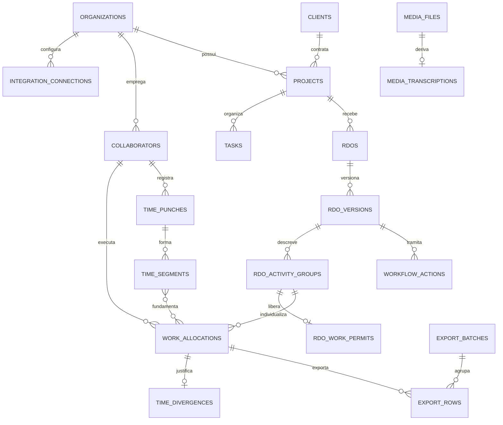

# Modelo de dados do MVP — RDO GLB Tech

## Decisão de arquitetura

O banco recomendado é **PostgreSQL 16 ou superior**. O modelo já nasce multiempresa: cada registro operacional pertence a uma `organization`. A GLB Tech será o primeiro tenant; a Interproject será cadastrada depois, sem compartilhar projetos, pessoas, RDOs ou credenciais.

Os arquivos de foto, vídeo e documento **não ficam dentro do PostgreSQL**. Eles ficam em armazenamento de objetos compatível com S3 (MinIO, S3 ou Azure Blob), e `media_files` guarda chave, hash, tipo, tamanho, GPS e autoria.

Credenciais das APIs também não ficam no banco. `integration_connections.secret_ref` guarda apenas a referência ao secret do Docker/Portainer.

## Relações principais

## Fonte mestre por domínio

| Domínio | Fonte mestre no MVP | Regra |
|---|---|---|
| Empresa/tenant | Aplicativo | GLB Tech primeiro; Interproject depois |
| Cliente, projeto, tarefa | IMUV | Aplicativo mantém projeção local e snapshot bruto; líder somente seleciona |
| Vínculos de projeto/tarefa | IMUV | Não editar no app no MVP |
| Colaborador | IMUV + DIMEP, após De-Para | Nenhuma correspondência por nome vira definitiva sem confirmação |
| Batida de ponto | DIMEP | Evento bruto é imutável; correção gera nova revisão |
| Horário declarado e atividade | RDO | Líder informa/confirma; divergência fica explícita |
| Aprovação e auditoria | Aplicativo | Independente do IMUV |
| Cronômetro | Exportação para IMUV | Arquivo no MVP; API somente quando o recurso for confirmado no tenant |
| Evidência | Armazenamento de objetos | PostgreSQL guarda apenas metadados e vínculo |

## Mapa dos dados obrigatórios levantados

| Conjunto | Campo/regra | Tabela/coluna principal | Obrigatoriedade |
|---|---|---|---|
| Projeto | ID IMUV, código, nome, endereço, status e datas | `projects` | Automático, IMUV |
| Cliente | ID IMUV, razão social e CPF/CNPJ | `clients` | Automático, IMUV |
| Tarefa | ID, código, nome, status, descrição e projeto | `tasks` | Automático, IMUV |
| Equipe | nome, CPF, função, departamento e situação | `collaborators` + `collaborator_external_refs` | Automático, IMUV/DIMEP |
| Vínculo | colaboradores do projeto | `project_members` | Automático, IMUV |
| Responsáveis | colaboradores atribuídos à tarefa | `task_assignees` | Automático, IMUV |
| RDO | empresa, projeto, data e identidade estável | `rdos` | Automático |
| Versão | versão, líder, autoria, status e datas | `rdo_versions` | Automático; nunca sobrescrever versão anterior |
| Atividade | tarefa, local, intervalo, execução, produção | `rdo_activity_groups` | Obrigatório |
| Equipe da atividade | vários colaboradores em uma ação do líder | `work_allocations` | Obrigatório; gera uma linha por pessoa |
| Ponto original | batidas e segmentos do DIMEP | `time_punches`, `time_segments` | Automático e imutável |
| Horário declarado | início/fim confirmado pelo líder | `work_allocations.declared_*` | Obrigatório |
| Divergência | tipo, diferença em minutos e justificativa | `time_divergences` | Obrigatório quando horário mudar ou faltar batida |
| Exceções | lacuna, sobreposição, não alocado, meia-noite | `time_exceptions` | Toda exceção precisa ser resolvida/justificada |
| Local | frente, área, equipamento ou tag | `work_locations` | Obrigatório por atividade |
| Produção | quantidade/unidade e avanço diário | `rdo_activity_groups` | Quantidade e unidade condicionais; avanço opcional |
| Materiais | usado, recebido ou faltante | `material_catalog`, `rdo_material_entries` | Condicional |
| Equipamentos | uso, parada e indisponibilidade | `equipment_assets`, `rdo_equipment_usage` | Condicional |
| Clima | condição, fonte e impacto | `rdo_conditions` | Opcional; detalhe obrigatório se houver impacto |
| Permissão de Trabalho | número, abertura, fechamento e status por tarefa | `rdo_work_permits` | Opcional; número obrigatório quando houver horário |
| Segurança | DDS, EPI, condição insegura e ação | `rdo_safety_checklists` | Obrigatório em todo RDO |
| Ocorrência | incidente, acidente, bloqueio e providência | `rdo_occurrences` | Condicional; descrição, ação e evidência obrigatórias |
| Qualidade | inspeção, teste, resultado e NC | `rdo_quality_records` | Condicional; rejeição exige ação corretiva |
| Evidência | foto, vídeo, documento e GPS | `media_files`, `evidence_links` | Obrigatória em ocorrência; opcional no serviço normal |
| Áudio e transcrição | arquivo original e texto derivado, sem sobrescrita | `media_files`, `media_transcriptions` | Opcional; original sempre preservado |
| Continuidade | pendência e próximo passo | `rdo_followups` | Opcional |
| Aprovação | envio, devolução, aprovação e revisão | `workflow_actions` | Obrigatório para fechar o fluxo |
| Auditoria | antes/depois, usuário, data e motivo | `audit_events` | Automático e imutável |
| Comunicação | lembretes e devoluções | `notifications` | Interno no MVP; canais externos depois |
| Exportação | lote, linha, checksum e resultado | `export_batches`, `export_rows` | Automático e idempotente |

## Os sete campos do cronômetro IMUV

Cada `work_allocation` aprovado gera uma linha em `export_rows`.

| Campo de exportação | Origem |
|---|---|
| `TIPO` = `Tarefa` | valor fixo |
| `CÓDIGO DA TAREFA` | `tasks.code` ou ID do tenant, após homologação |
| `HORA INICIAL` | `work_allocations.declared_start_at` |
| `HORA FINAL` | `work_allocations.declared_end_at` |
| `CPF DO COLABORADOR` | `collaborators.cpf_digits` confirmado no De-Para |
| `CÓDIGO DO PROJETO` | `projects.code` ou ID do tenant, após homologação |
| `CPF/CNPJ DO CLIENTE` | `clients.document_digits` |

O arquivo de importação usa exatamente a aba `Página1`, essas sete colunas nessa ordem, fonte Arial 10 e datas Excel reais no formato `dd/mm/yyyy hh:mm:ss`. O relatório narrativo do RDO é outro artefato e não reutiliza esse layout.

A view `v_imuv_timer_candidates` só expõe RDO aprovado/revisado e registros com documentos presentes. `export_rows.payload_sha256` e `export_batches.idempotency_key` impedem reenvio acidental do mesmo conteúdo.

## Regras que evitam duplicidade e dados sem sentido

1. IDs internos são UUIDs; IDs do IMUV/DIMEP são chaves externas, nunca a chave primária do app.
2. Projeto, cliente e tarefa têm unicidade por tenant e ID externo.
3. CPF/CNPJ válido é único dentro da empresa. Documento inválido continua armazenado como dado de origem, marcado como inválido, e não é usado para vinculação automática.
4. Nome normalizado serve apenas para busca e sugestão. O vínculo IMUV ↔ DIMEP só é definitivo após `identity_match_reviews.status = confirmed`.
5. Uma empresa só pode ter um RDO por projeto/data. Alterações criam `rdo_versions`; não substituem o histórico.
6. Uma atividade do líder vira várias `work_allocations`, uma por colaborador. Isso mantém o preenchimento simples sem perder granularidade para o IMUV.
7. Intervalos do mesmo colaborador não podem se sobrepor dentro da mesma versão do RDO; o PostgreSQL bloqueia pela constraint GiST.
8. Quantidade sempre vem acompanhada da unidade; parada de equipamento exige motivo; falha de segurança exige detalhe e ação.
9. Batidas, snapshots de integração, ações de workflow e auditoria são append-only.
10. Fotos iguais são deduplicadas por SHA-256; o banco não armazena o arquivo binário.
11. Integrações são idempotentes por ID externo + hash do payload; exportações, por chave do lote + hash da linha.
12. Todas as tabelas operacionais carregam `organization_id`, e as FKs compostas impedem relacionar dados de tenants diferentes.

## Regra de lacuna, sobreposição e tempo não alocado

- **Sobreposição:** duas tarefas atribuídas à mesma pessoa no mesmo minuto. O banco bloqueia.
- **Lacuna:** existe tempo trabalhado entre as batidas DIMEP que não foi associado a uma atividade. O líder precisa atribuir uma tarefa (inclusive genérica: administrativo, deslocamento, treinamento etc.) ou justificar.
- **Tempo não alocado:** total declarado é menor que o intervalo efetivamente trabalhado. Fica em `time_exceptions` e impede o envio enquanto estiver aberto.
- **Intervalo de almoço/pausa:** não vira apontamento; cada trecho trabalhado é um `time_segment` separado.
- **Batida ausente:** cria exceção e exige horário declarado + justificativa em `time_divergences`.
- **Virada de meia-noite:** é permitida, mas marcada como exceção para conferência.

## Workflow do MVP

| Papel | Pode fazer |
|---|---|
| Líder | criar/editar rascunho, selecionar equipe, preencher atividades, justificar divergências e enviar |
| Encarregado | devolver ou aprovar |
| Gerente | revisar aprovação e reabrir |
| Diretor | consultar tudo e criar nova versão corretiva em qualquer etapa; nunca apagar histórico |
| Administrador | cadastros, De-Para, integrações e suporte; sem aprovação operacional implícita |

Estados: `draft → submitted → approved → reviewed`. Uma devolução leva a `returned`; uma correção posterior cria nova versão e marca a anterior `superseded`.

Antes de aceitar `submitted`, o trigger chama `submission_errors()` e bloqueia: conciliação de horas ausente, atividade sem equipe, divergência sem justificativa, exceção aberta, checklist de segurança ausente ou ocorrência sem evidência.

## Aplicativo móvel

O banco não deve ser acessado diretamente por Android/iOS. Web, PWA e Flutter usam a mesma API HTTPS do backend.

Para o MVP, a opção de menor risco é um **webapp responsivo instalável como PWA**. Ele atende celular e desktop com a mesma base e evita manter dois produtos. Um simples WebView é aceitável apenas como embalagem temporária; câmera, upload, GPS, autenticação e modo offline costumam ficar mais frágeis. Flutter passa a fazer sentido quando houver requisito real de offline, captura em segundo plano, notificações push mais profundas ou publicação nas lojas.

## Fora do MVP, mas preparado no modelo

- Atualizar automaticamente `task.status` e `project.progress` no IMUV.
- Anexar resumo à observação da tarefa sem sobrescrever texto existente.
- Alterar responsáveis de projeto/tarefa pelo app; o IMUV continua mestre no MVP.
- WhatsApp, e-mail e push; `notifications.channel` já prevê os canais.
- API do cronômetro, se o fornecedor confirmar endpoint e semântica; até lá, usar arquivo rastreável.

## Pontos que exigem homologação antes de produção

1. Confirmar se o layout IMUV espera `task.id` ou `task.code`.
2. Confirmar se o projeto usa `project.id` ou `project.code`.
3. Confirmar formatos de data/hora, timezone e comportamento de reimportação.
4. Capturar amostras reais dos endpoints/payloads do tenant GLB Tech; a documentação pública é dinâmica e não substitui contrato de integração.
5. Definir os códigos das tarefas genéricas por projeto: administrativo, deslocamento, treinamento e tempo sem projeto.
6. Definir política de retenção de evidências e auditoria segundo LGPD e obrigações trabalhistas.
