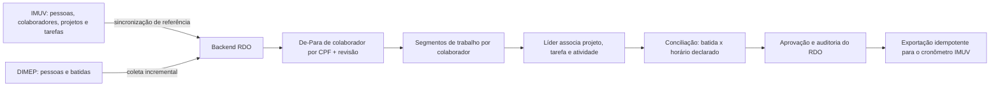

# APIs DIMEP Kairos e IMUV — guia completo de integração

## 1. Escopo e fontes

Este documento descreve as APIs públicas encontradas para o DIMEP Kairos e o IMUV, com foco em autenticação, consulta, inclusão, alteração, remoção, sincronização e relacionamento entre os dois sistemas.

O levantamento foi feito em 17/08/2026 a partir de:

- Swagger 2.0 do DIMEP Kairos, versão declarada `v1`, com 141 operações e 100 modelos: [Swagger UI oficial](https://www.dimepkairos.com.br/swagger/ui/index).
- Documentação Apiary da IMUV, atualização declarada em `2026-03-27T11:57:14.091Z`, com 89 operações em 26 recursos: [API da IMUV.ME](https://imuv.docs.apiary.io/).
- Especificações capturadas localmente em `specs/dimep-swagger-v1.json` e `specs/imuv-apiary-2026-03-27.json`.
- Catálogo mecânico, endpoint por endpoint, em `API_DIMEP_IMUV_CATALOGO_EXAUSTIVO.md`.

“Completo” aqui significa completo em relação às especificações públicas capturadas. Plano contratado, permissões do usuário, módulos habilitados, país, versão e customizações do tenant podem alterar o que funciona em produção. Endpoints privados ou não publicados não são presumidos.

## 2. Visão executiva

| Aspecto | DIMEP Kairos | IMUV |
|---|---|---|
| Papel principal no projeto | Pessoas, relógios, batidas, ocorrências e jornada | Clientes, colaboradores, projetos, tarefas e operação empresarial |
| Base URL | `https://www.dimepkairos.com.br` | `https://{subdominio}.imuv.me/administrator/api` |
| Autenticação | Cabeçalhos `identifier` + `key` | `Authorization: Bearer {auth_key}` |
| Obtenção da credencial | `POST /RestServiceApi/System/GetIntegrationRestApi` | `POST /auth/login` |
| Estilo | RPC sobre HTTP: quase tudo é `POST` | REST: `GET`, `POST`, `PUT`, `DELETE` |
| Operações publicadas | 141: 134 `POST` e 7 `GET` | 89: 31 `GET`, 21 `POST`, 19 `PUT`, 18 `DELETE` |
| Paginação | Campo `Pagina` em recursos específicos | `page` e `per-page` em coleções que os declaram |
| Exclusão | Ação `Delete*`, `UnMark*`, `Remove*` ou equivalente, via `POST` | Normalmente `DELETE /recurso/{id}` |
| Incremental de batidas | `GetAppointmentsPointer` + `SetAppointmentsPointer` | Não há recurso público de cronômetro/apontamento de horas na especificação |
| Formato dominante | JSON, embora o Swagger declare também XML/text/form em várias rotas | JSON ou `multipart/form-data`, conforme o recurso |

Não existe, nas fontes públicas analisadas, uma integração direta DIMEP → IMUV. O backend do RDO deve ser o orquestrador e manter chaves externas e De-Para próprios.

## 3. API DIMEP Kairos

### 3.1 Base, protocolo e convenções

A URL de uma operação é formada por:

```text
https://www.dimepkairos.com.br + /RestServiceApi/{Grupo}/{Operação}
```

Exemplo:

```text
https://www.dimepkairos.com.br/RestServiceApi/People/SearchPeople
```

Características importantes:

- O verbo HTTP não representa o CRUD. Consultas, inclusões, alterações e exclusões são quase sempre `POST`; a ação está no nome da rota.
- Em 88 operações, o corpo é publicado apenas como `object`, sem schema formal de propriedades. Nesses casos, o exemplo textual do Swagger é a especificação mais detalhada disponível.
- Nomes de campos são em PascalCase na maior parte da API: `Matricula`, `DataInicio`, `ResponseType`.
- Datas não têm um padrão único. Há operações com `dd-MM-yyyy`, outras com `dd/MM/yyyy`, data e hora com `dd/MM/yyyy HH:mm` e rotas recentes com ISO 8601. Use exatamente o formato documentado por operação.
- Várias consultas exigem `ResponseType: "AS400V1"` como valor fixo.
- O Swagger declara principalmente respostas `200`; não oferece uma taxonomia completa de `4xx/5xx`.

### 3.2 Como obter e usar a chave de integração

#### Passo 1 — obter a chave

```http
POST /RestServiceApi/System/GetIntegrationRestApi HTTP/1.1
Host: www.dimepkairos.com.br
Content-Type: application/json

{
  "Email": "usuario-da-integracao@empresa.com",
  "Password": "<senha>"
}
```

Resposta exemplificada no Swagger:

```json
{
  "Sucesso": true,
  "Mensagem": "",
  "Obj": {
    "Key": "<chave-de-integracao>"
  }
}
```

O Swagger também declara `identifier` e `key` como cabeçalhos opcionais nessa própria operação. Como a rota existe para obter a chave inicial, trate o corpo com e-mail/senha como o fluxo principal e homologue se o tenant exige também o `identifier` nessa chamada.

#### Passo 2 — autenticar as demais operações

```http
identifier: <documento-da-empresa>
key: <chave-de-integracao>
Content-Type: application/json
```

`identifier` é o documento da empresa/tenant, sem pontuação:

- Brasil: CNPJ ou CPF;
- Portugal: NIF;
- México: RFC ou CURP.

Os nomes de cabeçalho HTTP não diferenciam maiúsculas e minúsculas, mas use `identifier` e `key` para seguir a documentação.

Exceções:

- `ApplicationHealthCheck` e `DatabaseHealthCheck` usam `HealthCheck-Token`.
- `POST /RestServiceApi/MobileAppAuth/Authenticate` retorna um token do módulo móvel; não substitui a chave da API de integração.
- `POST /RestServiceApi/Mark/SetMarks` também aceita o cabeçalho `cpf`; sob a Portaria 671, o CPF do responsável deve estar no cabeçalho ou em `CpfResponsavel` no corpo.

### 3.3 Exemplo básico de chamada autenticada

```bash
curl --request POST \
  'https://www.dimepkairos.com.br/RestServiceApi/People/SearchPeople' \
  --header 'Content-Type: application/json' \
  --header 'identifier: <CNPJ_OU_CPF_SEM_PONTUACAO>' \
  --header 'key: <CHAVE_DIMEP>' \
  --data '{
    "CPF": "<CPF_SEM_PONTUACAO>",
    "Excluido": false,
    "Pagina": 1,
    "CarregarBiometrias": false
  }'
```

### 3.4 Como consultar, incluir, alterar e remover

| Intenção | Padrão DIMEP | Exemplo |
|---|---|---|
| Consultar lista | `POST .../Search*` ou `.../Get*` com filtros no JSON | `People/SearchPeople` |
| Consultar um registro | `POST .../Search*` com `Id`, matrícula, CPF ou outro identificador | `People/SearchPerson` |
| Incluir | `POST .../Save*`, `Create*`, `Mark*` ou `Set*` | `People/SavePerson` |
| Alterar | `POST .../Change*`, `Edit*`, `ReMark*`, `Update*` | `People/ChangePerson` |
| Remover | `POST .../Delete*`, `Remove*`, `UnMark*`, `Unassociate*` | `People/DeletePerson` |

#### Consultar pessoas

`POST /RestServiceApi/People/SearchPeople`

Filtros documentados incluem `Id`, `Matricula`, `Cracha`, `CodigoPis`, `CPF`, `IdEstruturaOrganizacional`, `Extra1` a `Extra10`, `Modificado`, `Excluido`, `Pagina` e `CarregarBiometrias`.

#### Incluir uma pessoa

`POST /RestServiceApi/People/SavePerson`

O payload é amplo e dependente da configuração do Kairos. Entre os campos publicados estão:

- identificação: `Matricula`, `Cracha`, `Nome`, `Cpf`, PIS e campos extras;
- admissão: `DataAdmissao`, `DataNascimento`, `BaseHoras`;
- vínculos: `Estrutura`, `TipoFuncionario`, `TipoSalario`, `Horario`, `Regra`;
- conformidade: `CpfResponsavel` para os cenários da Portaria 671.

Não envie um payload “mínimo” inventado: resolva antes os IDs de estrutura, horário e regra de cálculo usando os endpoints de resumo correspondentes. O exemplo integral está no catálogo exaustivo.

#### Alterar uma pessoa

`POST /RestServiceApi/People/ChangePerson`

O corpo deve carregar `Id` e os dados necessários do funcionário. A operação é de atualização rica e o Swagger não declara semântica de PATCH; portanto, até homologação, trate-a como substituição dos campos esperados e não omita valores existentes inadvertidamente.

#### Remover uma pessoa

```http
POST /RestServiceApi/People/DeletePerson
Content-Type: application/json
identifier: <documento>
key: <chave>

{
  "Id": 151,
  "CpfResponsavel": "<cpf-do-responsavel>"
}
```

Não presuma exclusão física. `SearchPeople` possui o filtro `Excluido`, o que indica que registros excluídos continuam consultáveis em algum estado lógico.

### 3.5 Batidas e marcações

Há dois conjuntos que parecem semelhantes, mas têm finalidades diferentes:

- `Appointment`: coleta e ponteiro de marcações para integração.
- `Mark`: consulta e gravação explícita de marcações.

#### Consultar marcações por período

`POST /RestServiceApi/Appointment/GetAppointments`

```json
{
  "IdsPessoa": [0],
  "DataInicio": "01-08-2026",
  "DataFim": "16-08-2026",
  "ResponseType": "AS400V1"
}
```

`GetAppointmentsV2` amplia os filtros para IDs, crachás, matrículas, PIS, CPFs, NIFs, e-mails e CNPJs. Também declara `CalculoNaoAtualizado` para incluir ou restringir dias conforme o estado do cálculo.

#### Coleta incremental com ponteiro

1. Chame `POST /RestServiceApi/Appointment/GetAppointmentsPointer` com os filtros, `MarcacaoColetadaAPI`, período e `Pagina`.
2. Persista cada batida localmente com chave externa/idempotente e salve o payload bruto.
3. Somente após commit local, chame `POST /RestServiceApi/Appointment/SetAppointmentsPointer` com `IdsMarcacoes` ou período para alterar a flag de coleta.
4. Se a confirmação falhar, repita com segurança; a deduplicação local deve impedir duplicatas.

O `SetAppointmentsPointer` altera estado na origem. Nunca confirme o ponteiro antes de gravar as marcações localmente.

#### Gravar uma marcação

`POST /RestServiceApi/Mark/SetMarks`

```json
{
  "Matricula": 21,
  "DataHoraApontamento": "08/02/2026 18:00",
  "CpfResponsavel": "<cpf-do-responsavel>",
  "ResponseType": "AS400V1"
}
```

Para lote, use `POST /RestServiceApi/Mark/SetListMark` com `CpfResponsavel` e `lstMark`. Cada item pode carregar `Id`, `Matricula`, `DataHoraApontamento`, `NumeroFabricacao` e `Nsr`.

### 3.6 Obras e associação de apontamentos

O DIMEP publica CRUD de obras e associação temporal:

- `CreateWorks`: cria lista de obras;
- `EditWorks`: altera lista de obras;
- `RemoveWorks`: remove por códigos;
- `SearchWorks`: consulta;
- `GetReportEmployeeWorkSummary`: relatório por funcionário;
- `GetReportWorkSummary`: relatório por obra;
- `LinkPunchTimeRangeToWorks`: associa pessoas e intervalo a uma obra;
- `UnLinkPunchTimeRangeToWorks`: desfaz a associação.

`LinkPunchTimeRangeToWorks` exige `DataHoraInicio`, `DataHoraFim`, `CodigoObra` e ao menos um seletor de pessoa entre IDs, crachás, matrículas, PIS, CPFs ou NIFs.

### 3.7 Catálogo funcional completo DIMEP

| Domínio | Grupos e operações publicadas |
|---|---|
| Autenticação e sistema | `System/GetIntegrationRestApi`; `HealthCheck/ApplicationHealthCheck`; `HealthCheck/DatabaseHealthCheck` |
| Empresa e organização | `Company/GetCompany`; `OrganizationalStructure` com get/search/save/change/delete; `JobPosition` com search/save/change/delete; resumos de `Schedules` e `CalculationRules` |
| Pessoas | `People` com save/change/delete/search unitário/search lista/transition; associação e desassociação com obras; `RetornarMensagemExcecao` |
| Usuários | `User` com create/update/search/search por e-mail/verificação na base |
| Relógios | `Clock` com search, schedule commands, associate e unassociate people |
| Biometria | `Digital` e `Facial`, ambos com search/save/change/delete e busca de pessoas com/sem template |
| Marcações | `Appointment` com get, get V2, get pointer e set pointer; `Mark` com get, set, set list e comprovantes com/sem certificado |
| Solicitação de marcação | `PunchesRequest` com criar, consultar e aprovar |
| Ocorrências | `Absence`, `Delay`, `AbsenceDelay` e `ExtraHour` para consultar; `AbsenceDelay/Justify` para tratar |
| Afastamentos | `Absent` com tipos, marcar, desmarcar e consultar |
| Férias | `Holiday` com marcar, desmarcar, remarcar e consultar |
| Desligamentos | `Dismiss` com tipos, marcar e desmarcar |
| Justificativas | `Justification` com consulta e aprovador; `JustificationRequest` com criar, consultar e aprovar; `PreJustificationRequest` para inserir |
| Eventos e períodos | `Event` com tipos, eventos e eventos agrupados; `Period/GetPeriodOpen` |
| Relatórios | `ReportEmployeeHour`, `ReportEmployeePunch`, `ReportJourneySimplified` e `ReportTeamHour` |
| Obras | `Works` com create/edit/remove/search, dois relatórios e link/unlink de apontamentos |
| Aplicativo móvel | 46 operações em `MobileApp`: login, recuperação, dashboard, marcação, pareamento, face, empresas, contatos, saldo, assiduidade, férias, substituições, afastamentos, inconsistências, solicitações, processamento/aprovação, mensagens, FCM, notificações, smart tag, estrutura e logs; mais `MobileAppAuth/Authenticate` |

Os nomes, parâmetros, exemplos e respostas das 141 operações estão no catálogo exaustivo.

## 4. API IMUV

### 4.1 Base, tenant e formato

Cada ambiente usa seu próprio subdomínio:

```text
https://{subdominio}.imuv.me/administrator/api
```

Exemplo publicado:

```text
https://demo.imuv.me/administrator/api
```

Não use `demo` em produção. Armazene o subdomínio/base URL por organização.

### 4.2 Autenticação

#### Login

```http
POST /auth/login HTTP/1.1
Content-Type: application/json

{
  "email": "usuario@empresa.com",
  "password": "<senha>"
}
```

Resposta documentada:

```json
{
  "success": true,
  "username": "usuario",
  "email": "usuario@empresa.com",
  "auth_key": "<chave>"
}
```

#### Uso da chave

```http
Authorization: Bearer <auth_key>
```

A documentação chama o valor de `auth_key`, mas o transporte é Bearer. Não envie apenas `auth_key` como query string.

Alguns exemplos `PUT`/`GET` no Apiary omitem cabeçalhos por inconsistência editorial. Isso não significa acesso anônimo; mantenha o Bearer em todo recurso protegido.

#### Recuperação de senha

`POST /auth/recovery/request`

```json
{
  "email": "usuario@empresa.com"
}
```

Resposta documentada: `{ "success": true }`.

### 4.3 Padrão de consulta e CRUD

| Intenção | Padrão IMUV |
|---|---|
| Listar/filtrar | `GET /recurso?campo=valor&page=1&per-page=50` |
| Obter por ID | `GET /recurso/{id}` quando publicado |
| Expandir relações | `?expand=relacao1,relacao2`, nos recursos que declaram `expand` |
| Incluir | `POST /recurso` |
| Alterar | `PUT /recurso/{id}` |
| Excluir | `DELETE /recurso/{id}` |

`PUT` deve ser tratado como atualização completa até homologação. A documentação não garante PATCH semântico.

Conteúdo:

- Projetos usam `application/json` nos exemplos de criação/alteração.
- Vários recursos antigos usam `multipart/form-data`, inclusive em chamadas sem upload.
- Siga o `Content-Type` documentado por endpoint; não imponha JSON globalmente.

### 4.4 Exemplos práticos

#### Listar projetos

```bash
curl \
  'https://<SUBDOMINIO>.imuv.me/administrator/api/project?active=1&page=1&per-page=50&expand=members' \
  --header 'Authorization: Bearer <AUTH_KEY>'
```

Filtros publicados incluem `id`, `code`, `name`, `people_id`, `type`, `status`, `progress`, datas, `members_disp`, `tags`, `workflow`, `address`, `active`, ordenação, paginação e expansão.

#### Criar projeto

`POST /project` exige, pelo schema publicado, `name`, `code` e `start_date`.

```bash
curl --request POST \
  'https://<SUBDOMINIO>.imuv.me/administrator/api/project' \
  --header 'Authorization: Bearer <AUTH_KEY>' \
  --header 'Content-Type: application/json' \
  --data '{
    "name": "Obra Alfa",
    "code": "OBRA-ALFA",
    "start_date": "2026-08-17",
    "people_id": 123,
    "members": [],
    "tags": []
  }'
```

Sucesso documentado: HTTP `201`.

#### Alterar projeto

```http
PUT /project/{id}
Authorization: Bearer <auth_key>
Content-Type: application/json
```

O mesmo schema declara `name`, `code` e `start_date` como obrigatórios. Leia o registro atual antes de atualizar para não apagar campos não enviados.

#### Excluir projeto

```bash
curl --request DELETE \
  'https://<SUBDOMINIO>.imuv.me/administrator/api/project/123' \
  --header 'Authorization: Bearer <AUTH_KEY>'
```

Sucesso documentado: HTTP `204`, sem corpo.

#### Listar tarefas

```bash
curl \
  'https://<SUBDOMINIO>.imuv.me/administrator/api/task?active=1&page=1&per-page=50&expand=collaborator' \
  --header 'Authorization: Bearer <AUTH_KEY>'
```

A API publica filtros como `name`, intervalos de datas, prioridade, departamento, `collaborator_disp`, `follower_disp`, status, descrição, orçamento, tipo, `related_to`, `related_id`, paginação, ordenação e `expand`.

A especificação pública não fornece schema de corpo para `POST /task` nem `PUT /task/{id}`. Campos observados em respostas não devem ser automaticamente tratados como campos graváveis. Capture uma requisição válida do tenant ou obtenha o contrato do fornecedor antes de habilitar escrita.

#### Consultar colaboradores por CPF

```bash
curl \
  'https://<SUBDOMINIO>.imuv.me/administrator/api/collaborator?cpf_cnpj=<CPF_SEM_PONTUACAO>&active=1&page=1&per-page=50' \
  --header 'Authorization: Bearer <AUTH_KEY>'
```

O recurso expõe identificação, CPF/CNPJ, PIS, contatos, endereço, situação, empresa, tipo de colaborador, admissão, departamento, profissão, nível, gestor e configurações de hora extra.

### 4.5 Catálogo completo de recursos IMUV

| Recurso | Rotas/operações publicadas |
|---|---|
| Autenticação | `POST /auth/login`; `POST /auth/recovery/request` |
| Colaborador | `GET/POST /collaborator`; `PUT/DELETE /collaborator/{id}` |
| Departamento | `GET/POST /department`; `PUT/DELETE /department/{id}` |
| Etapa do fluxo | `GET/POST /card-status`; `PUT/DELETE /card-status/{id}` |
| Fluxo de trabalho | `GET/POST /workflow`; `PUT/DELETE /workflow/{id}` |
| Kits | `GET /kit` |
| Layout Checklist | `GET/POST /layout_checklist`; `PUT/DELETE /layout_checklist/{id}` |
| Layout Checklist Group | `GET/POST /layout_checklist_group`; `PUT/DELETE /layout_checklist_group/{id}` |
| Layout Checklist Item | `GET /layout_checklist_item`; `POST /layout_checklist`; `PUT/DELETE /layout_checklist_item/{id}` |
| Layout Checklist Item Workflow | `GET /layout_checklist_item_workflow`; `POST /layout_checklist`; `PUT /layout_checklist_item/{id}`; `DELETE /layout_checklist_item_workflow/{id}` |
| Leads | CRUD em `/lead`; `GET /lead/{id}/pdf` |
| Locais de estoque | CRUD em `/warehouse` |
| Meios de pagamento | `GET /payment-mode` |
| Movimentos de estoque | CRUD em `/stock-movement` |
| Ordens de produção | lista, detalhe, criar e alterar em `/production-order`; `GET /production-order/{id}/pdf`; sem DELETE publicado |
| Pessoas | CRUD em `/people` |
| Prazos de pagamento | `GET /payment-term` |
| Produtos | CRUD em `/product` |
| Projetos | lista/detalhe/criar/alterar/excluir em `/project` |
| Serviços | CRUD em `/service` |
| Tabelas de preço | `GET /price-list` |
| Tarefas | lista/detalhe/criar/alterar/excluir em `/task` |
| Tarefas pessoais | CRUD em `/todo` |
| Tipos de documento | `GET /bill-doc-type` |
| Tributação de serviços | `GET /service-tax` |
| Vendas | CRUD em `/sale`; `GET /sale/{id}/pdf` |

As rotas estranhas dos quatro recursos de checklist foram reproduzidas exatamente como publicadas. Há aparente reutilização/erro de documentação em alguns `POST` e `PUT`; devem ser homologadas antes de uso.

### 4.6 Códigos HTTP e limitações da documentação

- A maioria das operações IMUV documenta apenas HTTP `200`.
- Criação de projeto e ordem de produção documentam `201`.
- Exclusão de projeto documenta `204`; outras exclusões frequentemente documentam `200`.
- Não há contrato público completo de erros, rate limit, expiração da `auth_key`, refresh token, ETag ou concorrência otimista.
- Não assuma que corpo vazio com `200` significa falha; valide conforme cada endpoint.
- Implemente tratamento genérico para `401`, `403`, `404`, `409`, `422`, `429` e `5xx`, mesmo quando ausentes da documentação.

## 5. Como DIMEP e IMUV se relacionam

### 5.1 Fontes mestres recomendadas para este projeto

| Domínio | Fonte mestre | Estratégia local |
|---|---|---|
| Organização/tenant | Aplicativo | Uma configuração DIMEP e uma IMUV por `organization_id` |
| Cliente | IMUV `/people` | Projetar localmente e guardar `imuv_external_id` + payload bruto |
| Projeto | IMUV `/project` | Projetar localmente; não editar pelo RDO no MVP |
| Tarefa | IMUV `/task` | Projetar localmente; selecionar no RDO |
| Vínculos projeto/tarefa | IMUV | Sincronizar `members_disp`, responsáveis/expansões homologadas |
| Colaborador | IMUV + DIMEP | De-Para confirmado; nunca unir definitivamente só pelo nome |
| Batida original | DIMEP | Imutável localmente; correção deve gerar revisão/evento separado |
| Horário declarado e atividade | Aplicativo RDO | Comparar com batidas e exigir justificativa de divergência |
| Aprovação/auditoria | Aplicativo RDO | Não depender do workflow IMUV |
| Cronômetro IMUV | Arquivo no MVP | API apenas se o fornecedor confirmar endpoint do tenant |

### 5.2 Mapeamento de entidades

| DIMEP | IMUV | Chave de aproximação | Regra segura |
|---|---|---|---|
| `People.Id` | `collaborator.id` | CPF normalizado; PIS como evidência secundária | Guardar ambos os IDs; confirmação humana quando ambíguo |
| `People.Matricula` | colaborador/admissão | Matrícula, se a empresa mantiver o mesmo código | Não considerar globalmente única sem tenant |
| `OrganizationalStructure` | `department` | Código/descrição configurados | Tabela de De-Para; não unir por descrição automaticamente |
| `JobPosition` | profissão/nível do colaborador | código de cargo/profissão | De-Para explícito |
| `Works.Codigo` | `project.id` ou `project.code` | código de negócio | DIMEP espera código de obra; IMUV aceita código textual: mapear, não converter silenciosamente |
| Batida/intervalo | tarefa/projeto | colaborador + data/hora + alocação do líder | Uma batida não identifica sozinha a tarefa executada |
| Empresa `identifier` | subdomínio IMUV | organização local | Não existe identificador comum publicado |

### 5.3 Fluxo recomendado de ponta a ponta



Sequência operacional:

1. Sincronizar do IMUV pessoas/clientes, colaboradores, projetos, tarefas e vínculos necessários.
2. Sincronizar do DIMEP pessoas e marcações; guardar payload bruto e cursor/ponteiro.
3. Resolver o colaborador comum. CPF válido e normalizado é a chave principal; PIS, matrícula e nome servem como evidências, não como substitutos automáticos.
4. Formar segmentos de trabalho a partir das batidas sem alterar a origem.
5. O líder associa cada segmento ou horário declarado a projeto/tarefa/atividade.
6. Calcular lacunas, sobreposições e divergências. Exigir justificativa quando necessário.
7. Aprovar o RDO e congelar a versão usada na exportação.
8. Gerar as linhas do cronômetro IMUV com chave idempotente e hash.
9. Marcar como exportado apenas após confirmação inequívoca do destino.

### 5.4 Os sete campos do cronômetro IMUV

| Campo de saída | Origem recomendada |
|---|---|
| `TIPO` | valor fixo `Tarefa` |
| `CÓDIGO DA TAREFA` | `task.id` ou `task.code`, após homologação do tenant |
| `HORA INICIAL` | horário declarado/aprovado no RDO |
| `HORA FINAL` | horário declarado/aprovado no RDO |
| `CPF DO COLABORADOR` | CPF normalizado do De-Para confirmado |
| `CÓDIGO DO PROJETO` | `project.id` ou `project.code`, após homologação |
| `CPF/CNPJ DO CLIENTE` | `/people` resolvido a partir de `project.people_id` |

A especificação pública IMUV analisada não contém recurso `timer`, `time-entry`, `timesheet`, `chronometer` ou equivalente. Portanto, o envio desses sete campos por API não pode ser afirmado. O caminho seguro é o layout de importação em arquivo já previsto no MVP, até o fornecedor confirmar um endpoint e seu contrato.

### 5.5 Opção de espelhar projetos como obras DIMEP

Se houver benefício operacional no Kairos, um projeto IMUV pode ser espelhado em `Works` do DIMEP:

1. Criar um De-Para `imuv_project_id/code ↔ dimep_work_code`.
2. Usar `CreateWorks`/`EditWorks`/`RemoveWorks` para manter a projeção.
3. Usar `LinkPunchTimeRangeToWorks` para associar intervalos à obra.
4. Nunca presumir que `project.id`, `project.code` e `Works.Codigo` têm o mesmo tipo ou valor.

Esse espelhamento é opcional e não resolve o vínculo com tarefas IMUV; o RDO ainda precisa guardar a tarefa e a alocação detalhada.

## 6. Sincronização, idempotência e exclusões

### 6.1 Chaves

- IDs internos do aplicativo devem ser UUIDs próprios.
- IDs IMUV e DIMEP são chaves externas com unicidade por tenant/provedor.
- Para cada registro sincronizado, guarde `provider`, `external_id`, `organization_id`, `source_updated_at` quando existir, hash do payload e o JSON bruto.
- Não use CPF como chave primária. CPF é dado pessoal, pode chegar inválido e não substitui o ID de origem.

### 6.2 Incremental

- DIMEP: prefira o fluxo de ponteiro de `Appointment`, com paginação e confirmação pós-commit.
- IMUV: onde houver `updated_at`/intervalo de atualização, use watermark com sobreposição temporal; onde não houver, faça paginação completa e compare hashes.
- Paginação deve ter limite de segurança, detecção de página repetida e persistência do checkpoint.

### 6.3 Exclusão

- Espelhe exclusões/desativações como estado local; não apague imediatamente o histórico.
- DIMEP sugere exclusão lógica de pessoas pelo filtro `Excluido`.
- IMUV frequentemente possui campo `active`; `DELETE` pode representar exclusão lógica ou física conforme o recurso.
- RDOs, batidas, payloads de integração, aprovações e exportações devem ser append-only para auditoria.

### 6.4 Reenvio

Para qualquer escrita:

1. Calcule uma chave idempotente de negócio.
2. Grave a intenção local antes do envio.
3. Envie com timeout e correlation ID local.
4. Se houver timeout após o envio, consulte o destino antes de repetir.
5. Grave status HTTP, corpo, duração e tentativa, removendo segredos e PII desnecessária dos logs.

## 7. Erros, observabilidade e resiliência

Como as duas especificações documentam poucos erros, o cliente deve ser defensivo:

- `401/403`: não repetir em loop; renovar/reobter credencial conforme política e alertar se persistir.
- `404`: distinguir registro ausente de rota/módulo não habilitado.
- `409/422`: erro funcional ou validação; enviar para fila de correção, não retry cego.
- `429`: respeitar `Retry-After`, quando presente, e usar backoff com jitter.
- `5xx`, reset e timeout: repetir com backoff apenas quando a operação for idempotente ou sua reconciliação for possível.
- HTTP `200` não basta: validar o envelope, por exemplo `Sucesso`/`Mensagem` na DIMEP e `success` na autenticação IMUV.
- Não registrar `key`, `auth_key`, senha, template facial/digital completo, CPF integral ou payloads biométricos em logs comuns.

Métricas mínimas por integração:

- última sincronização iniciada e concluída;
- duração, páginas, registros lidos/criados/alterados/desativados;
- checkpoint/watermark atual;
- erros por endpoint e status;
- tamanho da fila de retry e idade do item mais antigo;
- divergências de identidade ainda não confirmadas;
- lotes IMUV pendentes, aceitos ou rejeitados.

## 8. Segurança e LGPD

- Execute as integrações somente no backend. Nunca coloque `key` ou `auth_key` no navegador/PWA.
- Guarde credenciais em Docker Secrets, cofre de segredos ou variáveis protegidas; no banco, armazene apenas `secret_ref`.
- Separe credenciais por tenant e por ambiente.
- Use TLS e valide certificado/hostname; não aceite modo inseguro em produção.
- Aplique menor privilégio no usuário DIMEP/IMUV.
- Trate CPF, PIS, biometria digital, facial, geolocalização e jornada como dados pessoais; biometria é dado pessoal sensível.
- Defina retenção, acesso e trilha de auditoria. Exporte ou replique biometria apenas quando houver finalidade, base legal e necessidade comprovadas.
- Mascare documentos em telas e logs; deixe o valor integral somente onde operacionalmente necessário e autorizado.

## 9. Homologação obrigatória antes de produção

1. Confirmar base URL, subdomínio IMUV e `identifier` DIMEP de cada tenant.
2. Criar usuários técnicos de menor privilégio e validar rotação/expiração das chaves.
3. Capturar respostas reais de login, erro de credencial, registro inexistente, validação, duplicidade e rate limit.
4. Confirmar limites de página e volume nas duas APIs.
5. Confirmar timezone do tenant, horário de verão e todos os formatos de data/hora usados.
6. Validar `GetAppointmentsPointer`/`SetAppointmentsPointer` em sandbox, inclusive reprocessamento.
7. Confirmar o significado de `CalculoNaoAtualizado` e o momento correto de consumir dias ainda não calculados.
8. Confirmar se exclusões são lógicas ou físicas por recurso.
9. Confirmar se atualização IMUV é parcial ou substitutiva.
10. Confirmar os endpoints inconsistentes de Layout Checklist.
11. Confirmar o vínculo de tarefas com projeto: `related_to`, `related_id` e/ou expansões disponíveis no tenant.
12. Confirmar se o layout do cronômetro usa `task.id` ou `task.code`, e `project.id` ou `project.code`.
13. Solicitar formalmente à IMUV qualquer endpoint privado de cronômetro; não inferir sua existência.
14. Confirmar se projetos devem ser espelhados em `Works` no DIMEP e definir a codificação.
15. Testar com dados não produtivos antes de habilitar escrita, exclusão, ponteiro ou associação de batidas.

## 10. Índice dos artefatos

- `API_DIMEP_IMUV_GUIA_DE_INTEGRACAO.md`: decisões, fluxos, exemplos e relacionamento.
- `API_DIMEP_IMUV_CATALOGO_EXAUSTIVO.md`: todas as operações, parâmetros, modelos e exemplos publicados.
- `specs/dimep-swagger-v1.json`: snapshot Swagger usado para o catálogo DIMEP.
- `specs/imuv-apiary-2026-03-27.json`: snapshot Apiary usado para o catálogo IMUV.
- `../tools/generate_api_catalog.ps1`: regenerador do catálogo a partir das especificações JSON locais.
- `../database/DICIONARIO_DADOS_MVP.md`: fonte mestre, De-Para, conciliação e exportação no modelo do RDO.
- `../database/001_initial_schema.sql`: implementação relacional das regras do MVP.
